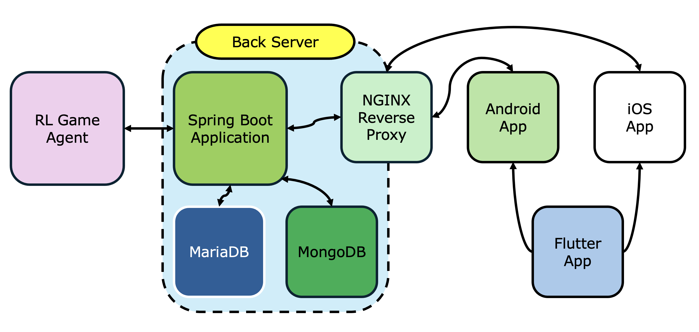

# Quoridouble

강화학습 기반 AI와 PvP 대전, 개선된 UX가 구현된 Quoridor 게임 앱

 

**시연 영상** (클릭 시 YouTube로 연결됨):

 

## Overview

### 프로젝트명

Quoridouble - 강화학습 기반 AI와 PvP 대전, 개선된 UX가 구현된 Quoridor 게임 앱

### 제작기간

2024.08 ~ 2024.11 (진행중)

### 팀원 및 역할

<table border="1">
    <tr>
        <td align="center"></td>
        <td align="center"></td>
        <td align="center"></td>
    </tr>
    <tr>
      <td align="center">김준기 팀장, Application, RL</td>
        <td align="center">이현준 UI/UX, Backend, 문서화</td>
        <td align="center">최호연 QA, Backend</td>
    </tr>
</table>

 

## Background

### 현황

- 팀원들이 전략적 보드게임(체스, 오목, Quoridor)을 즐김
- 체스, 오목은 다양한 모바일 앱이 시장에 존재
- Quoridor는 상대적으로 인지도가 낮음

### 기존 Quoridor 앱의 문제점

- 앱의 수가 매우 적음
- 조작감 등 UX가 좋지 않음
- PvP(Player vs Player) 기능 부재

### 개선 목표

- 강화학습 AI 구현
- PvP 기능 구현
- 사용자 경험(UX) 개선

 

## Objectives

### 1. 선행 연구 (8월)

- Depth Limited Alpha-Beta Pruning 알고리즘을 활용한 5✕5 Mini 버전 프로토타입 개발 (Python 구현)
- AI 에이전트의 기본 로직 확립

### 2. 앱 개발 (9~10월)

- Flutter를 사용하여 크로스 플랫폼 앱 개발
- AI 에이전트를 Dart 언어로 포팅
- UI/UX 구현(개선점; 조작 및 벽 설치 등) 및 AI 2-way Game 구현

### 3. 최적화 연구 (10월)

- Quoridor AI 에이전트 성능 향상을 위한 길찾기 알고리즘 비교 연구 (한국실천공학교육학회 교육매체개발 및 아이디어 경진대회 동상 수상)
- 프로그래밍 언어별 성능 분석

### 4. 서버 구현 (11월)

- AI 에이전트를 C++로 포팅 및 최적화
- WebSocket으로 서버-앱 간 통신 구현(실시간 PvP 2-way Game)

 

## Technology Used

### Application

Flutter

### Backend

Spring Boot

### Database

MariaDB, MongoDB

### DevOps

Docker, NGINX, AWS Lightsail

### RL Game Agent

Depth-Limited Alpha-Beta Pruning, Path-Finding Algorithm

 

## Technical Flowchart

 

## Study for Optimization

> Quoridor AI 에이전트의 성능 향상을 위한 길찾기 알고리즘 비교 연구 (한국실천공학교육학회)   [GitHub Link](https://github.com/RegistryHJ/quoridor-pathfind), [Competition Paper Link](https://1drv.ms/b/s!Aiuea30kcZTlh9QuE58l6tLuY61Ivg?e=8lhQ4r)

 

---

Copyright © 2024 KibleLab
